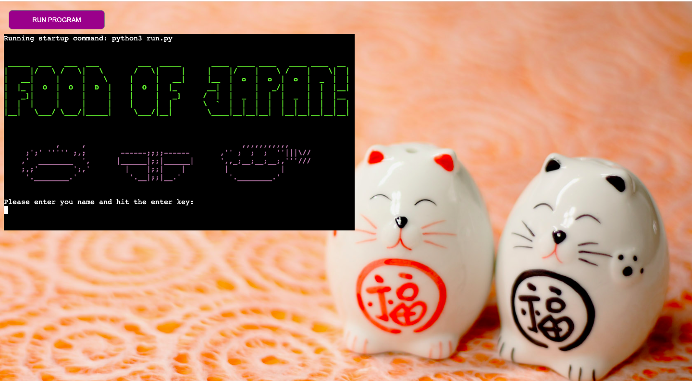
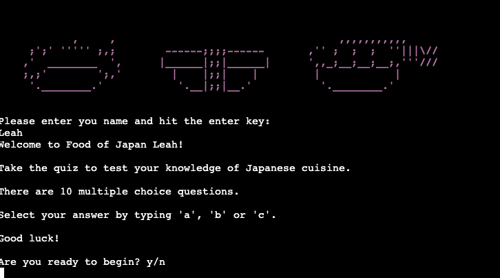
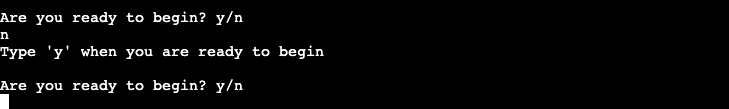
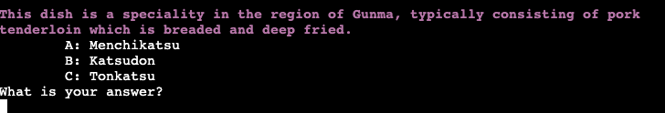
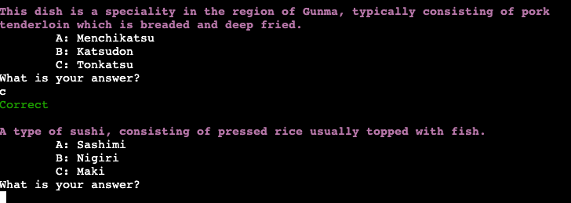
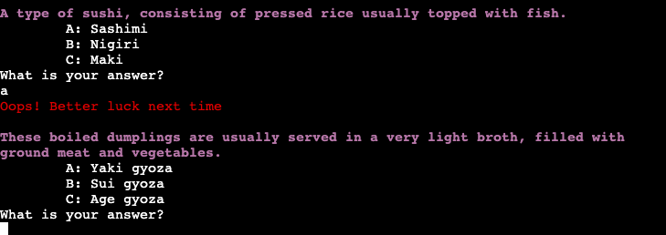
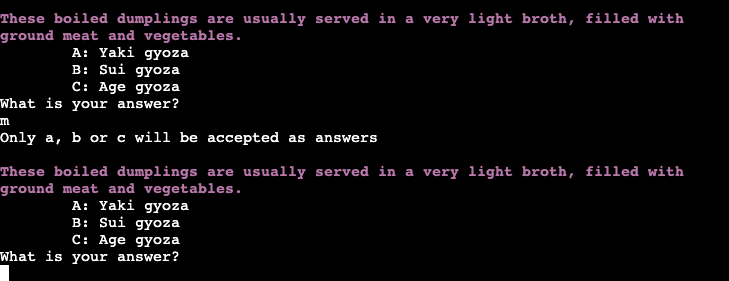

Use consistent and effective markdown formatting that is well-structured, easy to follow, and has few grammatical errors when writing a README file.

Write a README.md file in English for the Python application that explains its purpose and the value that it provides to its users.

# Food of Japan Quiz

My command line application built with Python is a quiz titled 'Food of Japan'. Users test their knowledge of Japanese cuisine by answering 10 food themed multiple choice questions, with their score being returned to them at the end of the quiz. They then have the option to play again, or end the quiz. 

<a href="https://food-of-japan-quiz.herokuapp.com/" aria-label="Link to open deployed site">Link to deployed site</a>

------

# Table of Contents:

1. [Flowchart](#flowchart)

2. [Wireframes](#wireframes)

3. [How To Play](#how-to-play)

4. [User Experience/Stories](#user-experience)

5. [Features](#features)

6. [Invalid Data Handling](#invalid-data-handling)

7. [Data Model](#data-model)

8. [Other Resources Used](#other-resources-used)

9. [Testing](#testing)

10. [Bugs](#bugs) 

11. [Deployment](#deployment)

12. [Credits](#credits)
   
   
------

# Flowchart
 
I used <a href="https://www.lucid.app">Lucid</a> to create a simple flowchart of the expected flow of logic through the programme from start to finish. This helped me to begin visualising the structure of the code, and what functions may be needed.   

# Wireframe

I produced a basic wireframe with <a href="https://www.balsamiq.com">Balsamiq</a>, as I wanted to include some visual elements at the start of the quiz including a title and some food related images. The wireframe helped me visualise what this could look like when the user initiates the programme. I discovered ASCII images and fonts, which can be used in a command line application, and so implemented this to add some basic styling at the start of the quiz. This wireframe was created during the early planning stages and does not represent the final presentation. 

------

# How to Play

------

# User Experience 
Present a clear rationale for the development of the project in the README, demonstrating that it has a clear, well-defined purpose addressing the critical goals of the application for a particular target audience (or multiple related audiences).

## Project Goals
- Provide the user with a fun, engaging and easy to play multiple choice quiz.
- Provide some visuals with the use of images and colour to contribute to a positive user experience.
- Provide an appropriate response to all user inputs and ensure any invalid data is handled appropriately. 
- Accurately keep track of and display the user’s score clearly at the end of the quiz. 

## User Stories
As a user I want:
- To play a fun and easy to use quiz.
-  Clear instructions on how to use the quiz.
- To test my knowledge of Japanese cuisine.
- To be informed when my input is invalid, and to be given the opportunity to correct any invalid input without interrupting the flow of the quiz.
- To be able to read the application output clearly. 
- To see my total score out of ten at the end of the quiz.
- To be able to easily repeat the quiz if I want to try again. 

------

# Features 
Document the rationale as to why a particular library/libraries are necessary for the implementation of the project.
Demonstrate, through screenshots, what the project outcomes are and how they have been met.

## Main page and welcome screen 
*Project Goal - Provide some visuals with the use of images and colour to contribute to a positive user experience.*

As design and layout features in command line applications are restrictive, I decided to add a background image to the main page by manipulating the provided template's CSS. I also changed the color of the 'Run Program' button to better match the color scheme. Although not explicitly required for this project, I wanted to enhance the user experience with the addition of some color and visuals. The background image is bright and cheerful, and the Japanese cat salt and pepper shakers are in keeping with the Japanese food theme.

I used ASCII font <a href="https://patorjk.com/software/taag/#p=display&f=Crawford2&t=Food%20of%20Japan!">'Crawford 2'</a> and <a href="https://asciiart.website/index.php?art=food%20and%20drink/other">art by Daniel Au</a> to create the quiz title and sushi icons, and have used the Python module 'Colorama' throughout the program to add color within the terminal.  

The first input in the program asks the user to enter their name. This gives some personalisation to the quiz, as the program returns the name as a welcome, and at the end when the final score is displayed. 

## Instructions
*As a user I want clear instructions on how to use the quiz*

Once the user has entered their name, they are given a personalised welcome message, and are presented with a short descripion and simple instructions for the quiz. I have used new line characters to space out the text lines here to improve readability. 

The user is then asked if they are ready to play the quiz by typing 'y' for yes or 'n' for no. This allows user initiation and control of the logic flow in this stage of the program. If the user types 'y' the quiz will begin, if 'n' is typed then a message appears asking them to type 'y' when ready, and the question repeats.

## Questions
*Project Goal - Provide the user with a fun, engaging and easy to play multiple choice quiz.*

*As a user I want to test my knowledge of Japanese cuisine.*

*As a user I want to be able to read the application output clearly.*

The quiz contains 10 multiple choice questions of varying difficulty (depending on the users level of interest and knowledge!), which are interated through in the same order each time the program is run. Each correctly answered question scores 1 point, and if the question is answered incorrectly then 0 points are awarded. To improve readability I have coloured the questions Magenta, and used the 'style.bright' Colorama feature to add boldness to the text. I have also used the tab character to indent the answer choices for the same purpose.  

If the correct answer is selected by the user, they are informed with the output 'correct' which is colored in green, followed by the next question. If an incorrect answer is selected, the output 'Oops! Better luck next time' is shown in red. 

## Final Score and Play Again
*Project Goal - Accurately keep track of and display the user’s score clearly at the end of the quiz.*

*As a user I want to see my total score out of ten at the end of the quiz.*

*As a user I want to be able to easily repeat the quiz if I want to try again.*

Once all 10 questions have been iterated through, the user is then presented with their final score. Different messages are displayed, depending on whether the score is equal to or less that 5, or greater than 5. The message is personalised with the users name. 

  

The user is also asked if they would like to play again, by typing 'y' for yes or 'n' for no. If 'y' is typed the program sequence starts again. If 'n' is typed, a message informs the user the the quiz has ended and to click the 'Run Program' button if they wish to reset the quiz. 

# Invalid data handling
Write code that handles empty or invalid input data.
Implement exception/error handling to optimise the user experience

## Name Input
Users must enter a string of text in the name input before they can proceed. If the input is left blank, or contains just whitespace, then an error message is displayed and the input is requested again. 

## Start Quiz
Users must type 'y' or 'n' to indicate if they are ready to start the quiz. If they enter any other character, then an error message is displayed and the input is requested again. 

## Answer Input 
Users must type 'a', 'b' or 'c' to select their chosen answer. If they enter any other character, then an error message is displayed and the question will be repeated. An invalid answer like this does not effect the users end score. 

## Play Again 
Users must type 'y' or 'n' to indicate whether or not they wish to play again. If they enter any other character, then an error message is displayed and the input is requested again.

## Features left to implement

------

# Data Model

- Dictionary?

# Other resources used

<a href="http://ami.responsivedesign.is/#"> - Am I Responsive</a>

<a href="https://balsamiq.com"> - Balsamiq</a>

------

# Testing
Pep8, given invalid inputs, tested in local/deployed terminals. 
Write Python code that passes through a linter (eg PEP8) with no significant issues.
Document the implementation of manual testing for code validation(using PEP Validators).

------

# Bugs
Document validation error-based fixes implemented and identify and explain any unsolved validation errors.

## Fixed
-

## Unfixed

------

# Deployment 

Deployment was done at the start of the project to allow device testing throughout the development process. 
Document the deployment procedure in a section in the README file.

My <a href="https://cornishcoder1.github.io/The-Green-Lorry/" aria-label="Link to open deployed site">project</a> was deployed via GitHub Pages as follows:

1. Go to https://github.com and login
2. Navigate to the required repository (The-Green-Lorry)
3. Click on the "Settings" button
4. Click on "GitHub Pages"
5. Under "Source", click the dropdown for "Branch" select "master" and then "Save"
6. A message will then appear stating that the website is published at the deployed address, this may take a few seconds.  

------

# Credits 

## Content

I used the following websites for research: 

- <a href="https://www.bristolactivecity.org.uk/np-area-map/">Bristol Active City Area Map</a> 
- <a href="https://shiply.com">Shiply.com</a>

 

## Media 

1. Nightstand hero image by <a href="https://www.flaticon.com/authors/freepik">Freepik</a> on <a href="https://www.flaticon.com/premium-icon/night-stand_997309?term=furniture&related_id=997360&origin=search"> Flaticon</a> 

2. Delivery van image by <a href="https://www.flaticon.com/authors/freepik" target="_blank" rel="noopener"> Freepik</a> on <a href="https://www.flaticon.com/premium-icon/delivery-van_3124236"> Flaticon</a>

3. Articulated Lorry Favicon by <a href="https://twitter.com/johnsorrentino">John Sorrentino</a> on <a href="https://favicon.io/emoji-favicons/articulated-lorry/"> Favicon.io</a>

 

## Acknowledgements 

- Dave_Horrocks_5P for his invaluable hours of assistance in helping me understand arrays (a previous PP2 idea), switch statements and CSS animation/keyframes. 
- Eventyret_mentor for spotting my file path bug and helping me fix it. 
- John_McPherson_5P for helping me fix my original if/else statement bug. 
- Jon_5P for his regular chats and positivity. 
- Kera Cudmore_5p & Matthias Kiesel_5p for their Peer Review feedback. 
- Love Maths project for reference and guidance.
- Sebastian Immel (Mentor)
- The book 'JavaScript for Kids' by Chris Minnick and Eva Holland. This is where the idea for the quote generator came from.
 