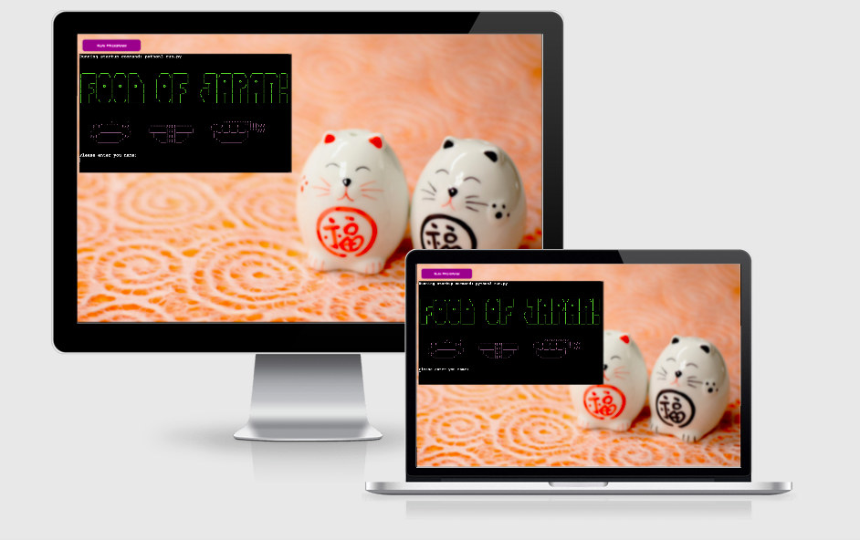
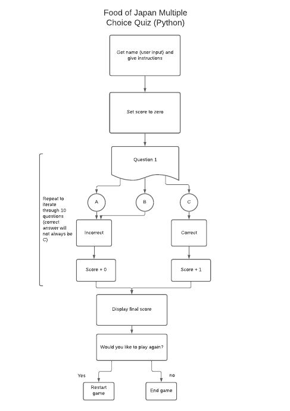
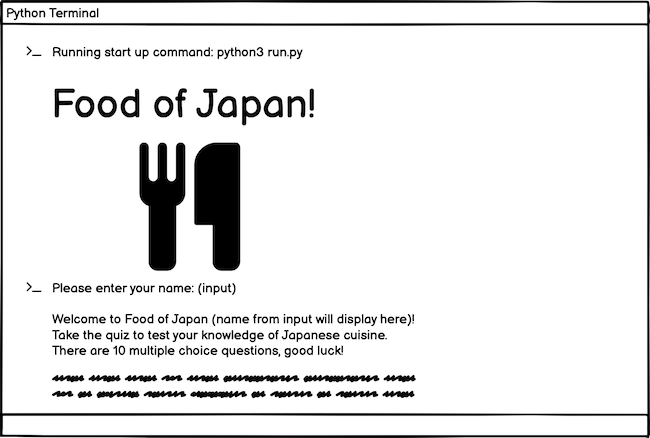

Use consistent and effective markdown formatting that is well-structured, easy to follow, and has few grammatical errors when writing a README file.

Write a README.md file in English for the Python application that explains its purpose and the value that it provides to its users.

# Food of Japan Quiz

My command line application built with Python is a quiz titled 'Food of Japan'. Users test their knowledge of Japanese cuisine by answering 10 food themed multiple choice questions, with their score being returned to them at the end of the quiz. They then have the option to play again, or end the quiz. 

<a href="https://food-of-japan-quiz.herokuapp.com/" aria-label="Link to open deployed site">Link to deployed site</a>

------

# Table of Contents:

1. [Flowchart](#flowchart)

2. [Wireframes](#wireframes)

3. [User Experience/Stories](#user-experience)

4. [How To Play](#how-to-play)

5. [Features](#features)

6. [Data Model](#data-model)

7. [Other Resources Used](#other-resources-used)

8. [Testing](#testing)

9. [Bugs](#bugs) 

10. [Deployment](#deployment)

11. [Credits](#credits)
   
   
------

# Flowchart
 
I used <a href="https://www.lucid.app">Lucid</a> to create a simple flowchart of the expected flow of logic through the programme from start to finish. This helped me to begin visualising the structure of the code, and what functions may be needed.   

# Wireframe

I produced a basic wireframe with <a href="https://www.balsamiq.com">Balsamiq</a>, as I wanted to include some visual elements at the start of the quiz including a title and some food related images. The wireframe helped me visualise what this could look like when the user initiates the programme. I discovered ASCII images and fonts, which can be used in a command line application, and so implemented this to add some basic styling at the start of the quiz. This wireframe was created during the early planning stages and does not represent the final presentation. 

------

# User Experience 
Present a clear rationale for the development of the project in the README, demonstrating that it has a clear, well-defined purpose addressing the critical goals of the application for a particular target audience (or multiple related audiences).

------

# How to Play

------

# Features 
Document the rationale as to why a particular library/libraries are necessary for the implementation of the project.
Demonstrate, through screenshots, what the project outcomes are and how they have been met.

**Heading and Introduction**

The heading and introductory text clearly explain to the user what the page is, and what service is being quoted for. 

**Quote Form**

This section allows the user to select the type of item they require a price for, and what areas the item is to be collected from and delivered to. If 'other' is selected in the 'type of item' selector then the user is advised to contact The Green Lorry for a bespoke quote. If the item is to be collected from an area outside of Bristol, then a distance surcharge is applied to the quote. No additional charges are applied to any of the specified 'Delivering to' locations, as they are all areas of Bristol (price variables are only applied to type of item and location of collection). Users can generate a new quote by changing the options and re-clicking the 'Generate Quote' button to refresh the quote output.  

**Quote Output Section**

This section returns the generated quote information based on what options the user has selected. It clearly displays a thank you message, distance surcharge (if applicable), item collection charge and most importantly the quote total. 

**Footer**

The footer contains contact information, should the user need further assistance and an animated lorry which moves across the page when the 'Generate Quote' button is clicked.  

## Features left to implement

This quote generator would work best as an element incorporated into a wider website for the fictional business. The generation of the quote could be the first step in a complete system which would also incorporate booking and payment. For the quote generator itself, there is alot of potential for it to be more intuitive. I would like to widen the range of items that are availble to select, or perhaps use a 'predictive' element where the user begins typing the item and the field autofills with potential options. I would also like to use a postcode API to make collection and delivery options more accurate, as the area options given at the moment are quite broad.  

------

# Data Model

- Dictionary?

# Other resources used

<a href="http://ami.responsivedesign.is/#"> - Am I Responsive</a>

<a href="https://balsamiq.com"> - Balsamiq</a>

------

# Testing
Pep8, given invalid inputs, tested in local/deployed terminals. 
Write Python code that passes through a linter (eg PEP8) with no significant issues.
Document the implementation of manual testing for code validation(using PEP Validators).

------

# Bugs
Document validation error-based fixes implemented and identify and explain any unsolved validation errors.

## Fixed
-

## Unfixed

------

# Deployment 

Deployment was done at the start of the project to allow device testing throughout the development process. 
Document the deployment procedure in a section in the README file.

My <a href="https://cornishcoder1.github.io/The-Green-Lorry/" aria-label="Link to open deployed site">project</a> was deployed via GitHub Pages as follows:

1. Go to https://github.com and login
2. Navigate to the required repository (The-Green-Lorry)
3. Click on the "Settings" button
4. Click on "GitHub Pages"
5. Under "Source", click the dropdown for "Branch" select "master" and then "Save"
6. A message will then appear stating that the website is published at the deployed address, this may take a few seconds.  

------

# Credits 

## Content

I used the following websites for research: 

- <a href="https://www.bristolactivecity.org.uk/np-area-map/">Bristol Active City Area Map</a> 
- <a href="https://shiply.com">Shiply.com</a>

 

## Media 

1. Nightstand hero image by <a href="https://www.flaticon.com/authors/freepik">Freepik</a> on <a href="https://www.flaticon.com/premium-icon/night-stand_997309?term=furniture&related_id=997360&origin=search"> Flaticon</a> 

2. Delivery van image by <a href="https://www.flaticon.com/authors/freepik" target="_blank" rel="noopener"> Freepik</a> on <a href="https://www.flaticon.com/premium-icon/delivery-van_3124236"> Flaticon</a>

3. Articulated Lorry Favicon by <a href="https://twitter.com/johnsorrentino">John Sorrentino</a> on <a href="https://favicon.io/emoji-favicons/articulated-lorry/"> Favicon.io</a>

 

## Acknowledgements 

- Dave_Horrocks_5P for his invaluable hours of assistance in helping me understand arrays (a previous PP2 idea), switch statements and CSS animation/keyframes. 
- Eventyret_mentor for spotting my file path bug and helping me fix it. 
- John_McPherson_5P for helping me fix my original if/else statement bug. 
- Jon_5P for his regular chats and positivity. 
- Kera Cudmore_5p & Matthias Kiesel_5p for their Peer Review feedback. 
- Love Maths project for reference and guidance.
- Sebastian Immel (Mentor)
- The book 'JavaScript for Kids' by Chris Minnick and Eva Holland. This is where the idea for the quote generator came from.
 